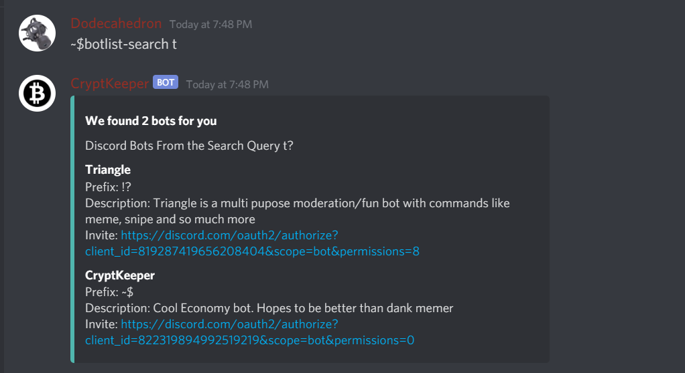

Most Recent: c2.0
# C2.0
## Updated
The Inventory Looks have been revamped! You now get more knowledge at the price of nothing! You can now also say ~$commands for commands.
## Added
~$commands Commands :D You can now learn the cryptKeeper ways....
You can now also learn how-to through better-guide Instead of guide. I took some time for this update, and I hope you like it as much as i do.

I also created A HANDMADE BOTLIST! If your rank is SUPERUSER, Or Higher, Then you can Submit a discord bot to have it searched. 

## Redid
The Inventory System
## Fixed
A Bug with autoload, Where if you reloaded, The autoload would reload your nonsaved points, essentially keeping you from earning more.
### Summary
This update is the beginning of the next chapter of CryptKeeper. You can learn about chapters by using the command `~$season | ~$chapters | ~$ecosystem chap | ~$ecosystem chapters | ~$ecosystem seasons`.
# C1.8
## Updated
The Look of mining has been changed!
You can now earn gold mines, And have them saved forever!
## Added
Ranks have just been added! You can now have the ultimate flex from your peers and stand out. Early access feature.

Profiles & Saves now search by ID Instead of username. This update was quite tedious to implement but helps cryptkeeper be not-so-annoying.
When you search, You must search by @ Mention. You can no longer search by username. Since Your ID never changes, You can save with your id instead of name, So if you change your name, You still have that beautiful upgrade.

Mining Now has little tooltips that appear when a user mines. You can view them at the bottom of every mine. I Think it's pretty cool!

I also added AutoLoad! It is an experimental feature which allows users to automatically load their data just by sending a message! This significantly reduces API Load times, and also fixes other things that I don't care about.

## Redid
The Mining Physics, I Fixed Numerous bugs within the code and in the api. Everything's Working!
## Fixed 
A Glitch where levels would go up silently.

### Summary
This is an update that adds huge things to cryptKeeper bitcoin simulator game.
# C1.6
## Updated
Mining Diagnostics.
## Added
- The Ability to make a profile. Users can now use profiles to view different user's stats. Must be manually updated. Auto Updates coming soon
- Support with the CryptKeeper API. http://api.cryptkeeper.tk
- External support for scripts.
- The Schematic for Ranks in further versions.
## Redid
Nothing.
## Fixed
Nothing.
# C1.4
## Updated
Message looks. New Embedded format.
Changed the feel of earning cash and Made prices higher
Added Diagnostics and more to be able to see your earnings for that specific mine.

## Added
- Licenses
- More Shops
- Buyer's License
- MemeBay
- Added Stupidly Unnecessary mining counter.
- PC Permanent Upgrades and Saving Updates
- Gold Mines
## Fixed
- A Glitch where the bot would give NaN Values for goldmines.
- You'd get goldmining from buying a *core*.
## Redid
- The Code
- Switch statements -> *if*
