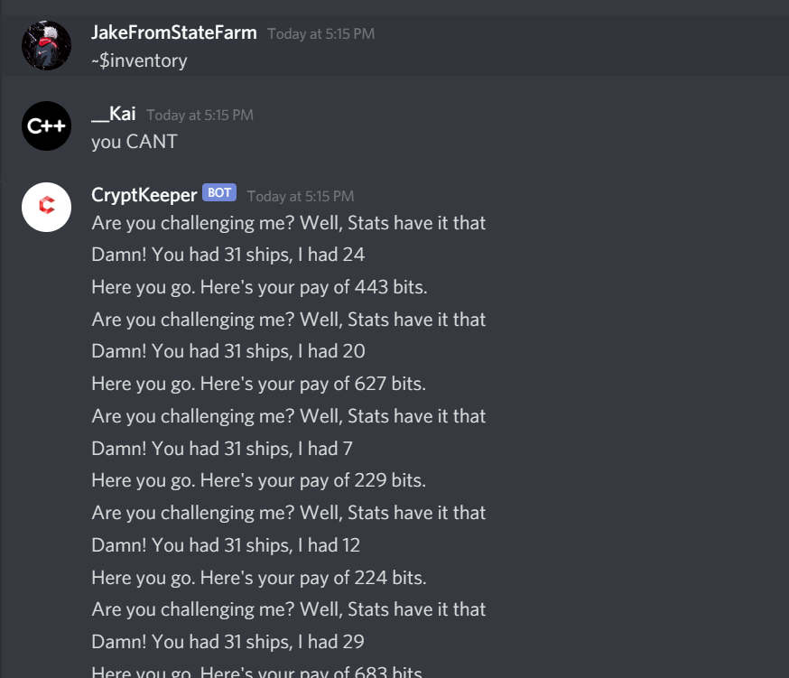
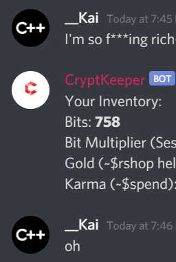

# CryptKeeper
Crypt is a discord bot originally written in Java, Until I realized java can't do the things javascript can do. 

CryptKeeper Fails to imitate dank memer in every way, shape, and form, But succeeds at being stupid and addicting.

You can also destroy the discord bot. Please don't this server costs less than my di-

You can also win the ship game by always putting 31 ships. Ignore tha-

you can Mine. You can also flex on your peers.

